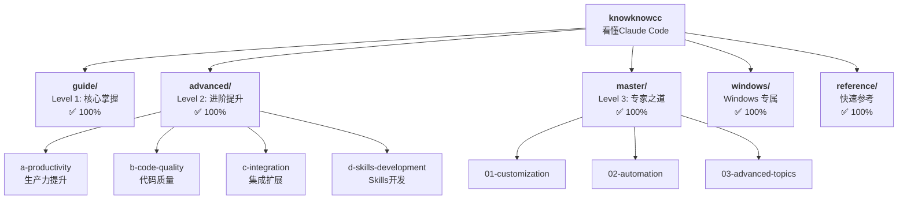

# knowknowcc 项目 - AI 工作指南

**项目**: knowknowcc (看懂Claude Code)
**版本**: v3.4.1
**最后更新**: 2026-01-26
**当前状态**: ✅ 全部完成！Level 1-3 + Windows + Reference

---

## 项目核心理念

**knowknowcc** 不是功能手册，而是精心设计的**学习体系**。

### 五大核心哲学

1. **少即是多** - 精选20%最核心内容，解决80%使用场景
2. **深度胜过广度** - 每个概念都讲透，原理+实践+案例
3. **由浅入深** - Level 1/2/3 三级体系，循序渐进
4. **实战导向** - 每个知识点都有真实案例和解决方案
5. **用户至上** - Windows 100%支持，多种学习路径

---

## 项目架构

### 三级知识体系

```
knowknowcc/
│
├── guide/          ← Level 1: 核心掌握
│   └── 新手入门，6个文档
│
├── advanced/       ← Level 2: 进阶提升
│   ├── a-productivity/  (生产力提升)
│   ├── b-code-quality/  (代码质量)
│   ├── c-integration/   (集成扩展)
│   └── d-skills-development/ (Skills开发)
│   └── 共17个文档
│
├── master/         ← Level 3: 专家之道
│   ├── 01-customization/ (自定义和扩展)
│   ├── 02-automation/    (自动化和CI/CD)
│   └── 03-advanced-topics/ (高级主题)
│   └── 共16个文档
│
├── windows/        ← Windows 专属
│   └── 4个文档
│
└── reference/      ← 快速参考
    └── 3个文档
```

### 当前完成情况

| 级别 | 完成度 | 文档数 | 状态 |
|------|--------|--------|------|
| Level 1 | 100% | 6 | ✅ 完成 |
| Level 2 | 100% | 17 | ✅ 完成 |
| Level 3 | 100% | 16 | ✅ 完成 |
| Windows | 100% | 4 | ✅ 完成 |
| Reference | 100% | 3 | ✅ 完成 |

**总计**: 56个核心文档，~805,000字

---

## 模块结构图



---

## 模块索引

| 模块 | 路径 | 职责 | 完成度 |
|------|------|------|--------|
| **guide** | `guide/` | Level 1 核心掌握，新手入门 | ✅ 100% |
| **advanced** | `advanced/` | Level 2 进阶提升，效率优化 | ✅ 100% |
| ├─ a-productivity | `advanced/a-productivity/` | 生产力提升技能 | ✅ 100% |
| ├─ b-code-quality | `advanced/b-code-quality/` | 代码质量提升 | ✅ 100% |
| ├─ c-integration | `advanced/c-integration/` | 集成和扩展 | ✅ 100% |
| └─ d-skills-development | `advanced/d-skills-development/` | Skills 开发教学 | ✅ 100% |
| **master** | `master/` | Level 3 专家之道，深度定制 | ✅ 100% |
| **windows** | `windows/` | Windows 平台专属支持 | ✅ 100% |
| **reference** | `reference/` | 快速参考和速查表 | ✅ 100% |

---

## 运行与开发

### 快速开始

```bash
# 1. 了解项目
查看 README.md 获取项目概览

# 2. 选择学习路径
新手: guide/ → advanced/ → master/
进阶: advanced/ → 选择需要的技能
专家: master/ → 深入高级主题

# 3. Windows 用户
windows/ → 查看 Windows 专属指南

# 4. 遇到问题
reference/ → 快速查找解决方案
```

### 创建新文档

```bash
# 1. 确定位置
选择: guide/ 或 advanced/ 或 master/

# 2. 遵循模板
包含: 概念、价值、方法、案例、Windows支持、FAQ

# 3. 质量检查
四维检查: 完整性、准确性、规范性、可读性

# 4. 验证信息
确保: 命令可运行、示例真实、链接有效
```

---

## 质量标准

每个文档必须满足：

- ✅ **完整性**: 是什么、为什么、如何使用、何时使用、注意什么
- ✅ **实战性**: 真实场景、完整流程、预期结果、常见问题
- ✅ **Windows支持**: 专门章节、PowerShell示例、路径说明
- ✅ **可验证性**: 验证标记、官方核对、实际测试
- ✅ **可读性**: 简洁明了、段落适中、逻辑清晰

---

## 测试策略

### 内容验证

- ✅ 所有命令经过测试
- ✅ 代码示例可运行
- ✅ Windows 示例在 PowerShell 7 验证
- ✅ 官方文档交叉核对

### 质量检查

- ✅ 四维质量检查（完整性、准确性、规范性、可读性）
- ✅ Windows 支持 100% 覆盖
- ✅ 实战案例真实可运行
- ✅ 完整的故障排查章节

---

## 编码规范

### 文件命名

```
格式: XX-<descriptive-name>.md

✅ 好的命名:
01-plan-mode.md
02-session-management.md
03-browser-automation.md

❌ 避免:
feature1.md
PlanMode.md
plan-mode
```

### 路径处理

```markdown
# 文档内链接（使用相对路径）
[快速上手](../guide/01-quickstart.md)  ✅
[Plan模式](./01-plan-mode.md)          ✅

# ❌ 避免绝对路径
[快速上手](D:/Projects/knowknowcc/guide/01-quickstart.md)
```

### Windows 路径

```powershell
# ✅ 推荐：使用正斜杠
cd "D:/Projects/MyApp"

# ⚠️ 备选：双反斜杠
cd "D:\\Projects\\MyApp"

# ❌ 避免：单反斜杠
cd "D:\Projects\MyApp"
```

### 代码块语言标记

```markdown
# PowerShell
```powershell
Get-ChildItem
```

# Bash
```bash
ls -la
```

# TypeScript
```typescript
const x: string = "hello";
```
```

---

## AI 使用指引

### 项目定位

**knowknowcc** = **看懂Claude Code**

这是一个:
- 📖 **系统的学习指南**：从新手到专家的完整路径
- 🛠️ **实用的工具手册**：解决实际问题的方案集合
- 🚀 **效率提升引擎**：让 AI 成为得力助手
- 🤝 **协作的平台**：社区共建的知识库

### 核心工作原则

1. **中文优先**
   - 所有内容使用简体中文
   - 面向中文用户
   - 符合中文阅读习惯

2. **Windows优先**
   - 优先考虑 Windows 用户
   - 每个功能都有 Windows 说明
   - 提供 PowerShell 示例

3. **实战导向**
   - 优先创建可立即应用的内容
   - 每个知识点都有真实案例
   - 包含"坑"和解决方案

4. **质量优先**
   - 宁可内容少，也要保证质量
   - 每个知识点都讲透
   - 避免信息过载

5. **持续验证**
   - 添加验证标记
   - 保持内容准确性
   - 更新验证报告

### 常见任务

#### 查看项目当前状态
```
@PROJECT-STATUS.md（最新综合状态）
@PROJECT-SUMMARY.md（实施总结）
@README.md（项目总览）
```

#### 创建新内容
```
1. 确定文档位置（Level 1/2/3）
2. 遵循文档模板结构
3. 包含所有必需章节
4. 添加 Windows 支持
5. 添加验证标记
6. 四维质量检查
7. 验证技术信息
8. 更新进度文档
```

#### 质量检查清单
```
维度1: 内容完整性
- [ ] 概念说明（是什么、为什么）
- [ ] 使用方法（语法、参数、结果）
- [ ] 实战案例（≥2个，详细步骤）
- [ ] Windows专属（完整章节）
- [ ] 常见问题（≥6个，解决方案）

维度2: 技术准确性
- [ ] 所有命令已测试
- [ ] 代码示例可运行
- [ ] 路径格式正确
- [ ] 验证标记准确
- [ ] 官方文档已核对

维度3: 格式规范性
- [ ] 标题层级正确（H1 > H2 > H3）
- [ ] 代码块语言标记正确
- [ ] 列表格式一致（- 或 *）
- [ ] 表格对齐正确
- [ ] 链接有效可访问

维度4: 可读性
- [ ] 语言简洁，无废话
- [ ] 段落长度适中（<10行）
- [ ] 主动语态，直接说明
- [ ] 没有重复内容
- [ ] 逻辑流程清晰
```

---

## 专题文档

### Skills 生态

详细内容请查看: [SKILLS-ECOSYSTEM.md](./SKILLS-ECOSYSTEM.md)

---

## Web 搜索策略

当进行网络搜索时，根据任务类型选择合适的 MCP：

### Open-websearch（90% 使用）

**完全免费**，支持多引擎并行，适用于大多数场景。

**特点**：
- ✅ 免费，无成本
- ✅ 多引擎并行（Bing、DuckDuckGo、Brave）
- ✅ 适合广度探索和初步研究
- ✅ 可作为付费 API 的补充来源

**优先引擎**: Bing

**适用场景**：
- 快速信息检索
- 宽泛主题探索
- 初步调研
- 交叉验证

### Exa / Tavily（10% 使用）

付费服务，高质量深度研究和语义理解。

**Exa - 神经语义搜索**：
- 🎯 理解查询意图，超越关键词匹配
- 🔍 专业的编程 API（get_code_context_exa）
- 💡 "Find Similar" 发现概念相关内容

**Tavily - RAG 优化**：
- 📊 实时事实验证
- 🔗 返回结构化数据
- 📈 相关性评分和引用信息

**适用场景**：
- 编程问题和技术文档查询
- 深度研究需要语义理解
- 实时查询和事实核查
- RAG 系统应用

### 核心策略
90% 免费探索 + 10% 付费深度研究

1. 首先使用免费的 **open-websearch** 进行广度探索
2. 仅在需要高质量深度研究或专业编程上下文时调用付费 MCP
3. 即使在深度研究中，**open-websearch 可作为免费补充来源**进行交叉验证
4. 根据查询复杂度、任务目标、结果质量和成本预算灵活选择

### 语言选择

**灵活选择中文或英文**：
- 根据哪种语言更好地服务具体查询或研究任务
- 可以混合使用两种语言进行搜索
- 在有益时并行进行中英文搜索
- 自然适应用户的沟通风格和各语言可用信息

---
```


```

## 相关资源

### 项目文档
- [README.md](README.md) - 项目总入口
- [PROJECT-STATUS.md](PROJECT-STATUS.md) - 项目状态与未来规划
- [PROJECT-SUMMARY.md](PROJECT-SUMMARY.md) - 项目实施总结
- [CHANGELOG.md](CHANGELOG.md) - 版本更新日志

### 模块文档
- [guide/CLAUDE.md](guide/CLAUDE.md) - Level 1 模块指南
- [advanced/CLAUDE.md](advanced/CLAUDE.md) - Level 2 模块指南
- [master/CLAUDE.md](master/CLAUDE.md) - Level 3 模块指南
- [windows/CLAUDE.md](windows/CLAUDE.md) - Windows 模块指南
- [reference/CLAUDE.md](reference/CLAUDE.md) - 参考模块指南

### 官方资源
- [Claude Code 官网](https://claude.ai/code)
- [官方文档](https://claude.ai/code/docs)
- [MCP 协议](https://modelcontextprotocol.io)

---

**最后更新**: 2026-01-26
**项目版本**: v3.4.1
**维护者**: knowknowcc 项目组
