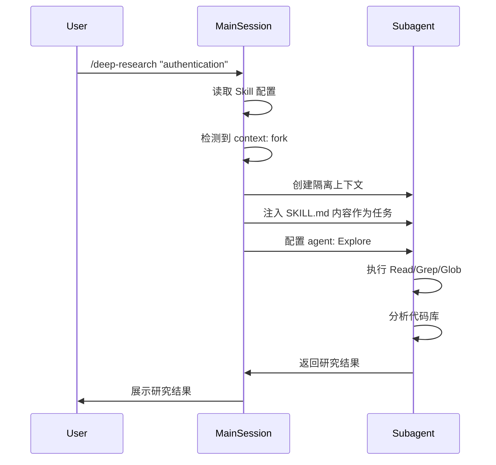

# 01 - Skill Fundamentals - Skills 基础概念

> **深入理解 Skills 的核心概念、结构和配置**

**阅读时间**: 45分钟
**难度**: ⭐⭐
**重要性**: ⭐⭐⭐⭐⭐
**前置要求**: [guide/05-skills-quickstart.md](../../guide/05-skills-quickstart.md)

> **📌 文档版本**: 基于 Claude Code v3.5 + Agent Skills 开放标准
> **✅ 验证状态**: ✅ 已验证（2026-02-15）
> **🔄 最后更新**: 2026-02-15 - 同步 Claude Opus 4.6 官方更新

---

## 目录

- [Agent Skills 开放标准](#agent-skills-开放标准) ⭐ NEW
- [Custom Slash Commands 合并说明](#custom-slash-commands-合并说明) ⭐ NEW
- [Subagent 执行模式 (`context: fork`)](#subagent-执行模式-context-fork) ⭐ NEW
- [动态上下文注入 (`!command`)](#动态上下文注入-command) ⭐ NEW
- [Skills 的两种类型](#skills-的两种类型)
- [SKILL.md 完整结构](#skillmd-完整结构)
- [核心字段详解](#核心字段详解)
- [调用控制矩阵](#调用控制矩阵)
- [参数传递机制](#参数传递机制)
- [Windows 路径处理](#windows-路径处理)
- [实战案例分析](#实战案例分析)
- [常见问题](#常见问题)
- [下一步](#下一步)

---

## Agent Skills 开放标准 ⭐ NEW

### 官方声明

Claude Code Skills 现在遵循 **Agent Skills 开放标准**：

```markdown
"Claude Code skills follow the Agent Skills open standard,
which works across multiple AI tools."
```

### 深度解读

#### 战略意义

1. **跨工具兼容性**
   - Skills 不再是 Claude Code 专属
   - 可以在多个 AI 工具中使用相同的 Skill
   - 标准化 = 生态系统爆发

2. **社区生态**
   - 社区 Skills 库将快速增长
   - 可复用性大幅提升
   - 跨平台 Skills 开发成为可能

3. **开发价值**
   - 一次开发，多平台使用
   - 标准化的结构和配置
   - 更广泛的适用范围

#### 实际影响

**对现有项目**：
- ✅ 现有 Skills 继续有效
- ✅ 无需修改现有配置
- ✅ 自动符合新标准

**对未来开发**：
- ✅ 可以设计跨平台 Skills
- ✅ 参考标准化的最佳实践
- ✅ 贡献到社区生态

### 标准化内容

Agent Skills 开放标准定义了：

1. **统一的 SKILL.md 结构**
   ```markdown
   ---
   # YAML Frontmatter
   name: skill-name
   description: Standard description format
   ---

   # Markdown Content
   Standardized instructions...
   ```

2. **标准化的 frontmatter 字段**
   - name: 技能名称
   - description: 功能描述
   - argument-hint: 参数提示
   - 等等（详见后文）

3. **跨平台兼容性要求**
   - 使用标准 Markdown
   - 避免工具特定的功能
   - 清晰的文档说明

#### 最佳实践

**✅ 推荐做法**：

```yaml
---
name: code-review
description: Cross-platform code review skill
# 标准字段，所有工具都支持
---
```

**❌ 避免做法**：

```yaml
---
name: claude-specific-skill
description: Only works in Claude Code
# 工具特定的配置可能降低兼容性
---
```

---

## Custom Slash Commands 合并说明 ⭐ NEW

### 官方变更

**Custom slash commands 已合并到 Skills**：

```markdown
"Custom slash commands have been merged into skills.
A file at .claude/commands/review.md and a skill at
.claude/skills/review/SKILL.md both create /review
and work the same way.

Your existing .claude/commands/ files keep working."
```

### 迁移指南

#### 现有 Commands 继续有效

**位置 1**: `.claude/commands/`
```bash
.claude/commands/
└── review.md  # ✅ 仍然有效
```

**位置 2**: `.claude/skills/`
```bash
.claude/skills/
└── review/
    └── SKILL.md  # ✅ 新的推荐方式
```

**两者效果相同**：
```bash
/review  # 两种方式都创建相同的命令
```

#### 为什么要迁移？

Skills 提供更多高级功能：

| 功能 | Commands | Skills |
|------|---------|--------|
| **创建 /command** | ✅ | ✅ |
| **Frontmatter 配置** | ✅ 有限 | ✅ 完整 |
| **Supporting files** | ❌ | ✅ 支持模板、示例、脚本 |
| **自动发现** | ❌ | ✅ Claude 可自动激活 |
| **Subagent 执行** | ❌ | ✅ `context: fork` |
| **动态上下文** | ❌ | ✅ `!command` 注入 |
| **工具限制** | ❌ | ✅ `allowed-tools` |

#### 迁移步骤

**步骤 1**: 创建 Skills 目录结构
```bash
# 创建 skill 目录
mkdir -p .claude/skills/review
```

**步骤 2**: 移动文件
```bash
# 移动 command 文件
mv .claude/commands/review.md .claude/skills/review/SKILL.md
```

**步骤 3**: 添加 frontmatter（如果原来没有）
```markdown
---
name: review
description: 代码审查技能。在用户要求 code review 时使用
---

# 原有的 command 内容...
```

**步骤 4**: 测试
```bash
/review  # 验证功能正常
```

#### 迁移决策树

```
现有 Command 需要迁移吗？
│
├─ 需要自动激活
│   └─ ✅ 迁移到 Skills
│       - 添加 description
│       - Claude 可自动调用
│
├─ 需要模板/示例文件
│   └─ ✅ 迁移到 Skills
│       - 创建 supporting files
│       - 更好的组织结构
│
├─ 需要在子代理中运行
│   └─ ✅ 迁移到 Skills
│       - 添加 context: fork
│       - 隔离执行环境
│
└─ 简单的静态命令
    └─ ⚠️ 可选迁移
        - 保持现状也OK
        - 但推荐迁移以保持一致性
```

#### 迁移示例

**原 Command** (`.claude/commands/greet.md`):
```markdown
# Greet Command

Greet the user warmly.

1. Ask for the user's name
2. Say hello with their name
3. Offer help
```

**迁移后的 Skill** (`.claude/skills/greet/SKILL.md`):
```markdown
---
name: greet
description: 友好地问候用户。在用户说"hello"、"hi"、"你好"时使用
---

# Greet Skill

## 问候流程

1. **询问姓名**: 礼貌地询问用户的名字
2. **个性化问候**: 使用用户的名字说你好
3. **提供帮助**: 主动询问是否需要帮助

## 示例对话

```
Claude: 你好！我是 Claude。请问你叫什么名字？
User: 我叫张三
Claude: 张三，你好！很高兴认识你。有什么我可以帮助你的吗？
```

## 注意事项

- ✅ 保持友好和专业
- ✅ 使用用户提供的名字
- ✅ 主动提供帮助
```

**改进点**：
- ✅ 添加了 description（支持自动激活）
- ✅ 更详细的流程说明
- ✅ 示例对话
- ✅ 注意事项

---

## Subagent 执行模式 (`context: fork`) ⭐ NEW

### 官方说明

**在隔离的子代理中运行 Skills**：

```markdown
"Add `context: fork` to your frontmatter when you want a skill to run
in isolation. The skill content becomes the prompt that drives the
subagent. It won't have access to your conversation history."
```

### 深度解读

#### 工作原理

**传统 Skills 执行**：
```
主会话上下文
    ↓
加载 Skill 内容
    ↓
在当前会话中执行
    ↓
可能污染主上下文
```

**Subagent 执行 (`context: fork`)**：
```
创建隔离上下文
    ↓
Skill 内容成为系统提示词
    ↓
在独立的 subagent 中执行
    ↓
返回结果到主会话
```

#### 核心优势

1. **上下文隔离**
   - 不污染主会话上下文
   - 独立的工具权限
   - 独立的执行环境

2. **专注执行**
   - Skill 内容成为明确的任务指令
   - Subagent 专注于单一任务
   - 减少干扰和混淆

3. **自动协调**
   - Claude 自主决定何时调用
   - 结果自动返回主会话
   - 无需人工干预

### 配置方法

#### Frontmatter 配置

```yaml
---
name: deep-research
description: Research a topic thoroughly
context: fork           # ⭐ 关键：启用 subagent 模式
agent: Explore          # ⭐ 指定 subagent 类型
allowed-tools: Read, Grep, Glob  # 限制工具访问
---
```

#### `agent` 字段选项

| Agent 类型 | 适用场景 | 默认工具 | 性能特点 |
|-----------|---------|---------|---------|
| **Explore** | 研究、探索、分析 | Read, Grep, Glob | 只读、快速、适合大规模探索 |
| **Plan** | 规划、架构设计 | Read, Grep, Glob | 结构化思考、生成计划 |
| **general-purpose** | 通用任务 | 所有工具 | 灵活、可写、适合复杂任务 |
| **自定义 Agent** | 特定领域 | 自定义 | 可配置模型、工具、权限 |

### 使用场景

#### ✅ 推荐使用 Subagent 模式的场景

1. **大规模代码库探索**
   ```yaml
   ---
   name: analyze-architecture
   description: Analyze project architecture and dependencies
   context: fork
   agent: Explore
   ---

   Analyze the architecture of $ARGUMENTS:

   1. Identify main components and their relationships
   2. Map dependency graph
   3. Document architectural patterns
   4. Identify potential improvements
   ```

2. **批量只读分析**
   ```yaml
   ---
   name: security-audit
   description: Audit codebase for security vulnerabilities
   context: fork
   agent: Explore
   ---

   Perform security audit on $ARGUMENTS:

   1. Search for common vulnerability patterns
   2. Check authentication/authorization implementations
   3. Review data validation
   4. Generate security report
   ```

3. **研究类任务**
   ```yaml
   ---
   name: deep-research
   description: Research a topic thoroughly
   context: fork
   agent: Explore
   ---

   Research $ARGUMENTS thoroughly:

   1. Find relevant files using Glob and Grep
   2. Read and analyze the code
   3. Summarize findings with specific file references
   ```

#### ❌ 不适合 Subagent 模式的场景

1. **参考内容型 Skills**
   ```yaml
   # ❌ 错误示例
   ---
   name: api-conventions
   description: API design patterns for this codebase
   context: fork  # ❌ 不应该用 fork
   ---

   # 这只是参考知识，不是可执行任务
   When writing API endpoints:
   - Use RESTful naming conventions
   - Return consistent error formats
   ```

   **原因**：Subagent 会接收到指南但没有可执行任务，会返回空结果。

2. **需要主会话上下文的 Skills**
   ```yaml
   # ❌ 错误示例
   ---
   name: continue-work
   description: Continue the current work
   context: fork  # ❌ 无法访问主会话
   ---

   Continue from where we left off...
   # 无法访问主会话的历史对话
   ```

### 执行流程详解

#### 完整执行流程



#### 关键时序说明

1. **预处理阶段**
   - Claude 检测到 `context: fork`
   - 准备创建隔离环境
   - 解析 `$ARGUMENTS` 等变量

2. **Subagent 创建**
   - 根据指定的 `agent` 类型配置环境
   - Skill 内容成为系统提示词
   - 主会话上下文不可见

3. **执行阶段**
   - Subagent 独立执行任务
   - 使用 `allowed-tools` 限制的工具集
   - 不受主会话干扰

4. **结果返回**
   - Subagent 完成任务后返回结果
   - 结果摘要展示在主会话
   - Subagent 上下文销毁

### 最佳实践

#### 1. 明确任务导向

**✅ 好的 Skill 内容**：
```markdown
---
name: find-dead-code
description: Find unused code in the codebase
context: fork
agent: Explore
---

Find dead code in $ARGUMENTS:

1. Search for all exported functions/classes
2. Check if they are imported elsewhere
3. Identify code with no references
4. Report findings with file:line references
```

**❌ 不好的 Skill 内容**：
```markdown
---
name: code-quality
description: Code quality guidelines
context: fork
agent: Explore
---

# Code Quality Guidelines

Follow these principles:
- Write clean code
- Use meaningful names
- Keep functions small

# ❌ 这是指南，不是任务
```

#### 2. 选择正确的 Agent 类型

| 任务类型 | 推荐 Agent | 原因 |
|---------|-----------|------|
| 只读探索 | Explore | 性能好，不会意外修改 |
| 规划设计 | Plan | 结构化输出，适合生成计划 |
| 复杂操作 | general-purpose | 需要写文件或执行命令 |
| 特定领域 | 自定义 Agent | 领域特定的工具和知识 |

#### 3. 合理限制工具访问

```yaml
# ✅ 研究任务：只读工具
allowed-tools: Read, Grep, Glob

# ✅ 生成任务：允许写入
allowed-tools: Read, Write, Edit

# ✅ 安全限制：避免危险操作
allowed-tools: Read, Grep, Glob, Bash(ls *)
```

### Windows 特别说明

#### PowerShell 路径处理

在 Subagent 中使用路径时，确保使用正斜杠：

```yaml
---
name: windows-research
description: Research Windows-specific code
context: fork
agent: Explore
---

Research Windows implementation in $ARGUMENTS:

# ✅ 使用正斜杠
Search in: src/windows/components
# ❌ 避免反斜杠
# Search in: src\windows\components
```

#### Bash 命令在 Windows

如果 Skill 需要执行命令，使用 PowerShell 语法：

```yaml
---
name: windows-analysis
description: Analyze Windows project structure
context: fork
agent: general-purpose
allowed-tools: Bash(powershell *)
---

Analyze project structure:

```bash
powershell -Command "Get-ChildItem -Recurse -File | Group-Object Extension | Sort-Object Count -Descending"
```
```

---

## 动态上下文注入 (`!command`) ⭐ NEW

### 官方说明

**预处理命令执行**：

```markdown
"The `!`command` syntax runs shell commands before the skill content
is sent to Claude. The command output replaces the placeholder, so
Claude receives actual data, not the command itself.

This is preprocessing, not something Claude executes."
```

### 深度解读

#### 工作原理

**执行时机**：
```
Skill 激活
    ↓
预处理阶段（!command 执行）
    ↓
命令输出替换占位符
    ↓
完整内容发送给 Claude
    ↓
Claude 看到实际数据
```

**关键区别**：
- **不是 Claude 执行命令**
- **是预处理机制**
- **Claude 只看到结果**

#### 核心优势

1. **实时数据获取**
   - 每次运行获取最新数据
   - 不需要手动更新
   - 保证数据新鲜度

2. **外部工具集成**
   - 集成 Git、GitHub CLI、npm 等
   - 执行系统命令
   - 获取动态上下文

3. **简化提示词**
   - Claude 不需要执行命令
   - 直接看到数据
   - 减少出错可能

### 语法详解

#### 基本语法

```markdown
---
name: pr-summary
description: Summarize changes in a pull request
---

## Pull request context

- PR diff: !`gh pr diff`
- PR comments: !`gh pr view --comments`
- Changed files: !`gh pr diff --name-only`

## Your task
Summarize this pull request...
```

#### 执行流程

1. **Skill 被调用**
   ```
   User: /pr-summary
   Claude: 激活 pr-summary skill
   ```

2. **预处理执行**
   ```bash
   # 这些命令立即执行（不是 Claude 执行）
   gh pr diff              # 获取 PR diff
   gh pr view --comments   # 获取 PR 评论
   gh pr diff --name-only  # 获取修改文件列表
   ```

3. **内容替换**
   ```markdown
   ## Pull request context

   - PR diff: <实际的 diff 内容>
   - PR comments: <实际的评论内容>
   - Changed files: <实际的文件列表>

   ## Your task
   Summarize this pull request...
   ```

4. **Claude 接收**
   ```
   Claude 看到完整的实际数据，不是命令
   ```

### 使用场景

#### ✅ 推荐场景

1. **Git/GitHub 集成**
   ```markdown
   ---
   name: git-status-report
   description: Generate current git status report
   allowed-tools: Bash(git *), Bash(gh *)
   ---

   ## Current repository status

   - Branch: !`git branch --show-current`
   - Status: !`git status --short`
   - Last commit: !`git log -1 --oneline`
   - Remotes: !`git remote -v`

   Analyze the repository status and provide recommendations...
   ```

2. **系统信息获取**
   ```markdown
   ---
   name: system-info
   description: Gather system information for debugging
   ---

   ## System information

   - OS: !`uname -a`
   - Node version: !`node --version`
   - npm version: !`npm --version`
   - Disk usage: !`df -h`

   Based on this system info, identify potential issues...
   ```

3. **项目依赖分析**
   ```markdown
   ---
   name: dependency-audit
   description: Audit project dependencies
   ---

   ## Dependencies

   - package.json: !`cat package.json`
   - Outdated packages: !`npm outdated`
   - Vulnerabilities: !`npm audit`

   Review dependencies and suggest updates...
   ```

4. **PR/Issue 上下文**
   ```markdown
   ---
   name: pr-review-context
   description: Load PR context for review
   context: fork
   agent: Explore
   allowed-tools: Bash(gh *)
   ---

   ## Pull request context

   - PR diff: !`gh pr diff`
   - PR comments: !`gh pr view --comments`
   - Changed files: !`gh pr diff --name-only`
   - CI status: !`gh pr checks`

   Review this PR thoroughly:
   1. Check code quality
   2. Verify tests
   3. Identify potential issues
   ```

#### ❌ 不推荐场景

1. **需要 Claude 决策的命令**
   ```markdown
   # ❌ 错误示例
   ---
   name: smart-deploy
   ---

   # Claude 无法决定部署哪个分支
   Deploy branch: !`git checkout $(claude-decide-branch)`
   ```

2. **长时间运行的命令**
   ```markdown
   # ❌ 错误示例
   ---
   name: full-test
   ---

   # 可能运行数分钟
   Test results: !`npm test -- --all`
   ```

3. **交互式命令**
   ```markdown
   # ❌ 错误示例
   ---
   name: interactive-setup
   ---

   # 需要用户输入
   Setup: !`npm init`
   ```

### 最佳实践

#### 1. 错误处理

**使用 fallback 值**：
```markdown
---
name: git-branch-info
---

## Current branch

- Name: !`git branch --show-current 2>/dev/null || echo "Not a git repository"`
- Status: !`git status --short 2>/dev/null || echo "Git not available"`
```

#### 2. 命令组合

**组合多个命令**：
```markdown
---
name: project-overview
---

## Project overview

- Languages: !`find . -name "*.js" -o -name "*.ts" -o -name "*.py" | head -20`
- File count: !`find . -type f | wc -l`
- Size: !`du -sh .`
```

#### 3. 格式化输出

**使用 jq 格式化 JSON**：
```markdown
---
name: package-analysis
---

## Package information

- Name: !`cat package.json | jq -r '.name'`
- Version: !`cat package.json | jq -r '.version'`
- Dependencies: !`cat package.json | jq -r '.dependencies | keys | .[]'`
```

### Windows 特别说明

#### PowerShell 命令

在 Windows 上，使用 PowerShell 语法：

```markdown
---
name: windows-system-info
---

## System information

- OS: !`powershell -Command "(Get-CimInstance Win32_OperatingSystem).Caption"`
- CPU: !`powershell -Command "(Get-CimInstance Win32_Processor).Name"`
- Memory: !`powershell -Command "(Get-CimInstance Win32_ComputerSystem).TotalPhysicalMemory / 1GB"`
```

#### 路径处理

确保路径使用正斜杠或转义反斜杠：

```markdown
---
name: windows-file-list
---

## Project files

- Files: !`powershell -Command "Get-ChildItem -Recurse -File | Select-Object -First 20 FullName"`
```

#### Git 命令兼容性

Git Bash 命令在 Windows 上可用：

```markdown
---
name: git-info
---

## Git information

- Branch: !`git branch --show-current`
- Status: !`git status --short`
- Log: !`git log -5 --oneline`
```

### 调试技巧

#### 查看预处理结果

如果 Skill 执行有问题，检查预处理命令：

1. **手动测试命令**
   ```bash
   # 在终端中运行命令看输出
   gh pr diff
   gh pr view --comments
   ```

2. **检查命令权限**
   ```bash
   # 确保命令可执行
   which gh
   gh auth status
   ```

3. **验证输出格式**
   ```bash
   # 检查输出是否符合预期
   gh pr diff | head -20
   ```

#### 常见问题

| 问题 | 原因 | 解决方案 |
|------|------|---------|
| 命令找不到 | 未安装工具 | 安装所需 CLI 工具 |
| 权限错误 | 未授权 | 运行 auth 命令（如 `gh auth login`） |
| 输出为空 | 命令失败 | 添加错误处理和 fallback |
| 超时 | 命令运行时间长 | 优化命令或使用异步处理 |

---

## Skills 的两种类型

理解 Skills 的两种类型是掌握其用法的关键。不同的类型适用于不同的场景。

### 类型 1: 参考内容型 (Reference Content)

#### 定义

提供知识库供 Claude 在当前工作中应用。内容会内联到对话上下文中。

#### 核心特征

- **自动激活**: Claude 根据描述自动决定何时使用
- **内联运行**: 内容直接插入到对话中
- **持续可用**: 在整个会话期间都可以被引用
- **知识导向**: 用于编码约定、模式、风格指南

#### 适用场景

| 场景 | 示例 |
|------|------|
| **编码规范** | API 设计模式、命名约定 |
| **项目约定** | 特定项目的架构规范 |
| **风格指南** | 代码风格、文档格式 |
| **最佳实践** | 安全实践、性能优化建议 |

#### 完整示例

```markdown
---
name: api-conventions
description: RESTful API 设计模式和规范。在用户设计或审查 API 端点时使用
---

# RESTful API 设计规范

## 命名约定

### URL 路径

**✅ 推荐**:
```
GET    /api/users          # 获取用户列表
GET    /api/users/123      # 获取特定用户
POST   /api/users          # 创建用户
PUT    /api/users/123      # 更新用户
DELETE /api/users/123      # 删除用户
```

**❌ 避免**:
```
GET    /api/getUsers       # 动词在 URL 中
POST   /api/createUser     # 动词在 URL 中
GET    /api/user           # 应该用复数形式
```

### HTTP 方法

| 方法 | 用途 | 幂等性 |
|------|------|--------|
| GET | 获取资源 | ✅ 是 |
| POST | 创建资源 | ❌ 否 |
| PUT | 完整更新资源 | ✅ 是 |
| PATCH | 部分更新资源 | ❌ 否 |
| DELETE | 删除资源 | ✅ 是 |

## 响应格式

### 成功响应

```json
{
  "data": { ... },
  "meta": {
    "page": 1,
    "per_page": 20,
    "total": 100
  }
}
```

### 错误响应

```json
{
  "error": {
    "code": "VALIDATION_ERROR",
    "message": "Invalid input data",
    "details": [
      {
        "field": "email",
        "message": "Email is required"
      }
    ]
  }
}
```

## 安全实践

1. **始终验证输入**: 使用 schema 验证
2. **使用认证**: JWT 或 OAuth 2.0
3. **限流**: 防止滥用
4. **CORS 配置**: 明确指定允许的来源
```

**关键点**:
- ✅ 没有设置 `disable-model-invocation: true`（默认可自动调用）
- ✅ description 清晰说明触发场景
- ✅ 提供了具体的 ✅ 和 ❌ 示例
- ✅ 包含代码示例和表格

---

### 类型 2: 任务型 (Task Content)

#### 定义

提供特定任务的分步指令，通常手动触发。

#### 核心特征

- **手动触发**: 通过 `/skill-name` 调用
- **隔离运行**: 可在子代理中运行（`context: fork`）
- **副作用操作**: 适合有副作用的操作（部署、删除、发送通知）
- **步骤导向**: 提供明确的执行步骤

#### 适用场景

| 场景 | 示例 |
|------|------|
| **部署流程** | 部署到生产环境 |
| **测试运行** | 执行测试套件 |
| **代码审查** | 系统化的代码审查 |
| **数据库操作** | 迁移、备份 |

#### 完整示例

```markdown
---
name: deploy-production
description: 部署应用到生产环境，包括测试、构建、推送、验证的完整流程
context: fork
disable-model-invocation: true
allowed-tools:
  - Bash
  - Read
  - Write
---

# 生产环境部署流程

## 前置检查

在开始部署前，确认：

1. **分支检查**: 必须从 `main` 或 `release/*` 分支部署
   ```bash
   git branch --show-current
   ```

2. **未提交更改**: 确保没有未提交的更改
   ```bash
   git status
   ```

3. **最新代码**: 拉取最新代码
   ```bash
   git pull origin main
   ```

## 部署步骤

### 步骤 1: 运行测试套件

```bash
# 运行所有测试
npm test

# 或使用特定测试框架
npm run test:ci
```

**退出条件**: 如果测试失败，停止部署并报告问题。

### 步骤 2: 构建应用

```bash
# 清理之前的构建
npm run clean

# 构建生产版本
npm run build

# 验证构建输出
ls -la dist/
```

**退出条件**: 如果构建失败，停止部署并报告问题。

### 步骤 3: 运行安全扫描

```bash
# 依赖漏洞扫描
npm audit

# 或使用第三方工具
npm run security-scan
```

**退出条件**: 如果发现高危漏洞，停止部署并等待修复。

### 步骤 4: 推送到生产环境

```bash
# 推送到部署服务器
scp -r dist/* user@production-server:/var/www/app/

# 或使用 CI/CD 工具
npm run deploy:production
```

### 步骤 5: 验证部署

```bash
# 健康检查
curl https://api.example.com/health

# 或使用监控工具
npm run health-check
```

**成功标准**: 返回 `200 OK` 状态码。

### 步骤 6: 回滚计划

如果验证失败：

```bash
# 回滚到上一个版本
npm run rollback

# 或手动恢复
git revert HEAD
npm run deploy:production
```

## 部署后通知

成功后发送通知：

```bash
# 发送 Slack 通知
slack-notify "Production deployment successful: $COMMIT_SHA"

# 或发送邮件
mail -s "Deployment successful" team@example.com
```

## 常见问题

### Q: 测试失败怎么办？

**A**: 停止部署，修复测试，重新开始。

### Q: 如何回滚？

**A**: 使用步骤 6 中的回滚命令。

### Q: 构建超时怎么办？

**A**: 检查服务器资源，增加超时时间，或优化构建流程。
```

**关键点**:
- ✅ `disable-model-invocation: true`（仅手动调用）
- ✅ `context: fork`（在子代理中运行）
- ✅ `allowed-tools` 限制可用工具
- ✅ 明确的步骤和退出条件
- ✅ 包含错误处理和回滚计划

---

### 类型对比总结

| 特性 | 参考内容型 | 任务型 |
|------|-----------|--------|
| **主要目的** | 提供知识和规范 | 执行具体操作 |
| **调用方式** | Claude 自动 + 手动 | 仅手动 |
| **配置** | 默认设置 | `disable-model-invocation: true` |
| **运行模式** | 当前会话 | 通常 `context: fork` |
| **工具限制** | 通常不限制 | 经常限制（`allowed-tools`） |
| **适用场景** | 编码规范、API 约定 | 部署、测试、审查 |
| **示例** | api-conventions | deploy-production |

---

## SKILL.md 完整结构

### 基本结构

```markdown
---
# YAML Frontmatter (配置区)
name: skill-name
description: 技能描述
---
# 空行是必需的

# Markdown 内容 (指令区)

Claude 遵循的指令...
```

### 关键组成部分

#### 1. YAML Frontmatter（必需）

**作用**: 配置技能行为

**格式**: 必须用 `---` 包围

**位置**: 文件顶部，前 3 行

**示例**:
```yaml
---
name: my-skill
description: 技能描述
---
```

#### 2. Markdown 内容（必需）

**作用**: Claude 遵循的指令

**格式**: 标准 Markdown

**位置**: YAML frontmatter 之后

**示例**:
```markdown
# 技能标题

## 背景

说明技能的目的和适用场景。

## 步骤

1. 步骤 1
2. 步骤 2
3. 步骤 3

## 注意事项

常见陷阱和解决方案。
```

### 完整模板

```markdown
---
name: skill-name
description: 清晰描述技能的功能和使用时机。在用户...时使用
argument-hint: [param1] [param2]
disable-model-invocation: false
user-invocable: true
allowed-tools:
  - Bash
  - Read
  - Write
model: sonnet
context: fork
agent: Explore
hooks:
  ToolStart:
    - type: command
      command: echo "Starting skill"
---

# 技能标题

## 背景

简要说明技能的目的和适用场景。

## 前置条件

使用此技能前需要满足的条件：

1. 条件 1
2. 条件 2
3. 条件 3

## 执行步骤

### 步骤 1: 步骤名称

**说明**: 步骤的目的

**操作**:
```bash
command here
```

**验证**:
```bash
# 验证步骤是否成功
validation command
```

### 步骤 2: 步骤名称

... (重复步骤结构)

## 输出格式

说明预期的输出格式或结果。

## 注意事项

### 常见错误

| 错误 | 原因 | 解决方案 |
|------|------|---------|
| 错误1 | ... | ... |

## 故障排查

### 问题 1: 症状

**原因**: ...
**解决方案**: ...

## 示例

提供 1-2 个完整的使用示例。
```

---

## 核心字段详解

### 1. name（可选但推荐）

**作用**: 技能的显示名称，用于手动调用

**格式**:
- 仅小写字母、数字、连字符
- 最多 64 个字符
- 不能以连字符开头或结尾

**示例**:
```yaml
---
name: deploy-production  # ✅ 好的命名
name: code_review        # ✅ 好的命名
name: API-Designer       # ❌ 避免大写
name: -test-runner       # ❌ 不能以连字符开头
---
```

**省略时**: 使用目录名作为技能名称

### 2. description（推荐）

**作用**: 告诉 Claude 何时使用此技能

**重要性**: ⭐⭐⭐⭐⭐ **最关键的字段**

**好的描述要素**:
1. **功能说明**: 技能做什么
2. **触发场景**: 何时使用
3. **目标用户**: 谁会使用（可选）

**对比示例**:

```yaml
# ❌ 不好的描述
description: 代码审查技能
```
**问题**: 太模糊，Claude 不知道何时调用

```yaml
# ⚠️ 一般的描述
description: 用于审查代码质量
```
**问题**: 稍好，但触发场景不明确

```yaml
# ✅ 好的描述
description: 在用户要求进行代码审查、检查代码质量或询问"这段代码有什么问题?"时使用
```
**优点**: 明确的触发场景和关键词

```yaml
# ✅ 优秀的描述
description: 系统化代码审查流程。在用户说"审查代码"、"code review"、"检查质量"或指向文件并询问"这有什么问题?"时激活。涵盖安全性、性能、可维护性三个维度。
```
**优点**: 非常详细的触发场景、关键词、覆盖范围

### 3. argument-hint（可选）

**作用**: 在自动完成时显示参数提示

**格式**: `[param1] [param2] ...`

**示例**:

```yaml
---
name: deploy
description: 部署应用
argument-hint: [environment] [branch]
---

# 输入 /deploy 时显示
/deploy [environment] [branch]
```

**使用场景**:
- 技能需要参数（文件名、环境、分支等）
- 提醒用户需要的输入

**对比**:

```yaml
# ❌ 没有 hint
/deploy  # 用户不知道需要什么参数

# ✅ 有 hint
/deploy [environment] [branch]  # 用户一目了然
```

### 4. disable-model-invocation（可选）

**作用**: 控制 Claude 是否可以自动调用此技能

| 值 | 效果 | 适用场景 |
|---|------|---------|
| `false` 或不设置 | ✅ Claude 可调用<br>✅ 你可调用 | 参考内容型 |
| `true` | ❌ Claude 不可调用<br>✅ 仅你可调用 | 任务型 |

**使用场景**:

**场景 1: 参考内容型 - 不设置或 false**

```yaml
---
name: api-conventions
description: API 设计规范
# disable-model-invocation: false  # 默认值，可不设置
---
```

**为什么**: 希望 Claude 在设计 API 时自动应用这些规范

**场景 2: 任务型 - 设置为 true**

```yaml
---
name: deploy-production
description: 部署到生产环境
disable-model-invocation: true  # 仅手动调用
---
```

**为什么**: 部署是有副作用的危险操作，必须用户明确触发

### 5. user-invocable（可选）

**作用**: 控制技能是否出现在 `/` 自动完成菜单中

| 值 | 效果 | 适用场景 |
|---|------|---------|
| `true` 或不设置 | ✅ 出现在菜单中 | 大多数技能 |
| `false` | ❌ 从菜单隐藏 | 后台知识 |

**使用场景**:

**场景 1: 普通技能 - 不设置或 true**

```yaml
---
name: greet
description: 问候用户
# user-invocable: true  # 默认值
---
```

**场景 2: 后台知识 - 设置为 false**

```yaml
---
name: internal-architecture
description: 项目内部架构文档（仅 Claude 使用）
user-invocable: false  # 从菜单隐藏
---
```

**为什么**: 这是供 Claude 参考的内部文档，用户不需要直接调用

### 6. allowed-tools（可选）

**作用**: 限制技能激活时可用的工具

**格式**: 工具名称列表

**可用工具**:
- `Bash`: 运行 shell 命令
- `Read`: 读取文件
- `Write`: 写入文件
- `Edit`: 编辑文件
- `Grep`: 搜索内容
- `Glob`: 文件匹配
- 等（其他 Claude Code 工具）

**示例**:

**场景 1: 只读任务**

```yaml
---
name: code-review
description: 代码审查
allowed-tools:
  - Read
  - Grep
  - Glob
# 不包含 Write、Edit、Bash（防止修改）
---
```

**为什么**: 代码审查应该是只读的，不应该修改代码

**场景 2: 测试运行**

```yaml
---
name: test-runner
description: 运行测试套件
allowed-tools:
  - Bash    # 运行测试
  - Read    # 读取测试结果
  - Write   # 写入测试报告
# 不包含 Edit（防止修改测试代码）
---
```

**为什么**: 只运行测试，不应该修改测试代码

**场景 3: 部署任务**

```yaml
---
name: deploy
description: 部署应用
allowed-tools:
  - Bash    # 运行部署命令
  - Read    # 读取配置
# 严格限制其他工具
---
```

**为什么**: 部署是危险操作，严格限制可用工具

### 7. model（可选）⭐ UPDATED

**作用**: 指定技能使用的模型

**可用值**（Claude Opus 4.6 更新）：
- `haiku`: 快速响应，成本最低，适合简单任务
- `sonnet`: 平衡模式，默认选择
- `opus`: 最强推理能力，适合复杂任务

**Claude Opus 4.6 新特性**：

支持通过 **Effort 参数** 控制推理深度：
```yaml
---
name: complex-analysis
description: 深度代码分析
model: opus
# Claude Opus 4.6 自动使用 Adaptive Thinking
---
```

**何时使用**:

| 任务类型 | 推荐模型 | 原因 |
|---------|---------|------|
| 快速查询、格式转换 | `haiku` | 速度快、成本低 |
| 常规开发任务 | `sonnet` | 性价比高、足够用 |
| 复杂重构、架构设计 | `opus` | 推理能力强、质量高 |
| 研究探索、多文件分析 | `opus` | 1M token context 支持 |

**示例**:

```yaml
# 快速任务
---
name: format-code
description: 格式化代码
model: haiku
---

# 常规任务（默认）
---
name: implement-feature
description: 实现新功能
# model: sonnet（默认，可不设置）
---

# 复杂任务
---
name: analyze-architecture
description: 分析系统架构
model: opus
---
```

### 8. context（可选）⭐ UPDATED

**作用**: 指定技能运行模式

| 值 | 效果 | 适用场景 | 上下文访问 |
|---|------|---------|-----------|
| 不设置 | 在当前会话运行 | 参考内容型 | ✅ 可访问主会话 |
| `fork` | 在子代理中运行 | 任务型 | ❌ 独立上下文 |

**官方说明**：

```markdown
"Add `context: fork` to your frontmatter when you want a skill to run
in isolation. The skill content becomes the prompt that drives the
subagent. It won't have access to your conversation history."
```

**何时使用 `context: fork`**:

1. **大规模探索**: 代码库分析、依赖关系研究
2. **隔离任务**: 不想污染当前会话上下文
3. **独立环境**: 需要不同的工具权限
4. **研究任务**: 只读操作、批量分析

**重要提示**：

⚠️ `context: fork` 只适合有明确任务的 Skills。如果 Skill 内容是参考知识而非可执行任务，Subagent 会返回空结果。

**详细使用指南**: 参见 [Subagent 执行模式 (`context: fork`)](#subagent-执行模式-context-fork) 章节

**示例**:

```yaml
---
name: deep-research
description: Research a topic thoroughly
context: fork
agent: Explore
---

Research $ARGUMENTS thoroughly:

1. Find relevant files using Glob and Grep
2. Read and analyze the code
3. Summarize findings with specific file references
```

### 9. agent（可选）⭐ UPDATED

**作用**: 当 `context: fork` 时，指定子代理类型

**可用值**：

| Agent 类型 | 适用场景 | 默认工具 | 性能特点 |
|-----------|---------|---------|---------|
| **Explore** | 研究、探索、分析 | Read, Grep, Glob | 只读、快速、适合大规模探索 |
| **Plan** | 规划、架构设计 | Read, Grep, Glob | 结构化思考、生成计划 |
| **general-purpose** | 通用任务 | 所有工具 | 灵活、可写、适合复杂任务 |
| **自定义 Agent** | 特定领域 | 自定义 | 可配置模型、工具、权限 |

**官方说明**：

```markdown
"The `agent` field specifies which subagent configuration to use.
Options include built-in agents (Explore, Plan, general-purpose)
or any custom subagent from .claude/agents/. If omitted, uses
general-purpose."
```

**选择指南**：

```yaml
# 只读探索任务
---
name: analyze-architecture
description: 分析项目架构
context: fork
agent: Explore  # ⭐ 推荐：只读、快速
allowed-tools: Read, Grep, Glob
---

# 规划设计任务
---
name: design-api
description: 设计 API 架构
context: fork
agent: Plan  # ⭐ 推荐：结构化输出
---

# 复杂操作任务
---
name: refactor-module
description: 重构模块
context: fork
agent: general-purpose  # ⭐ 推荐：需要写权限
allowed-tools: Read, Write, Edit, Bash
---
```

**自定义 Agent**：

可以创建领域特定的 Agent：

```yaml
# .claude/agents/frontend-expert.md
---
name: frontend-expert
description: Frontend development specialist
model: opus
allowed-tools: Read, Write, Edit, Bash(npm *), Bash(node *)
---

Focus on frontend best practices:
- React/Vue component patterns
- CSS/Tailwind styling
- Performance optimization
```

然后在 Skills 中使用：

```yaml
---
name: optimize-components
description: 优化 React 组件
context: fork
agent: frontend-expert  # ⭐ 使用自定义 Agent
---
```

### 10. hooks（可选）

**作用**: 在技能生命周期的特定点执行命令

**可用钩子**:
- `ToolStart`: 技能启动时
- `ToolEnd`: 技能结束时
- `ToolError`: 技能出错时

**示例**:

```yaml
---
name: deploy
description: 部署应用
hooks:
  ToolStart:
    - type: command
      command: echo "开始部署..."
    - type: command
      command: date
  ToolEnd:
    - type: command
      command: echo "部署完成"
  ToolError:
    - type: command
      command: echo "部署失败，请检查日志"
---
```

**详细说明**: 参见 [03-advanced-features.md](./03-advanced-features.md#hooks-生命周期)

---

## 调用控制矩阵

### 三种调用模式

根据 `disable-model-invocation` 和 `user-invocable` 的组合，有三种主要模式：

| 模式 | disable-model-invocation | user-invocable | 效果 | 适用场景 |
|------|-------------------------|----------------|------|---------|
| **双向调用** | `false` 或不设置 | `true` 或不设置 | ✅ Claude 可调用<br>✅ 你可调用 | 参考内容型 |
| **仅手动** | `true` | `true` 或不设置 | ❌ Claude 不可调用<br>✅ 仅你可调用 | 任务型 |
| **仅自动** | `false` 或不设置 | `false` | ✅ 仅 Claude 可调用<br>❌ 你不可调用 | 后台知识 |

### 模式详解

#### 模式 1: 双向调用（默认）

**配置**:
```yaml
---
name: api-conventions
description: API 设计规范
# 不设置或显式设置为 false
# disable-model-invocation: false
# user-invocable: true
---
```

**效果**:
```
✅ 场景 1: Claude 自动调用
你: "设计一个用户 API"
Claude: [自动激活 api-conventions 技能]

✅ 场景 2: 你手动调用
你: "/api-conventions"
Claude: [执行技能]
```

**适用场景**:
- ✅ 编码规范和约定
- ✅ API 设计模式
- ✅ 最佳实践指南

#### 模式 2: 仅手动调用

**配置**:
```yaml
---
name: deploy-production
description: 部署到生产环境
disable-model-invocation: true  # 关键配置
---
```

**效果**:
```
❌ 场景 1: Claude 不会自动调用
你: "部署到生产环境"
Claude: [不会激活 deploy-production 技能]
Claude: "我无法执行部署操作，请使用 /deploy-production 命令"

✅ 场景 2: 你手动调用
你: "/deploy-production"
Claude: [执行部署流程]
```

**适用场景**:
- ✅ 部署操作
- ✅ 删除操作
- ✅ 数据库修改
- ✅ 任何有副作用的危险操作

#### 模式 3: 仅自动调用（后台知识）

**配置**:
```yaml
---
name: internal-architecture
description: 项目内部架构文档
user-invocable: false  # 从菜单隐藏
---
```

**效果**:
```
✅ 场景 1: Claude 自动调用
你: "这个模块的架构是怎样的？"
Claude: [自动激活 internal-architecture 技能]
Claude: "根据项目架构文档..."

❌ 场景 2: 你无法手动调用
你: "/internal-architecture"
Claude: "错误：该技能不可手动调用"
```

**适用场景**:
- ✅ 内部文档
- ✅ 项目架构说明
- ✅ 仅供 Claude 参考的信息

### 决策树

```
需要技能做什么？
│
├─ 提供知识和规范
│   └─ 双向调用（默认）
│       └─ 不设置任何特殊配置
│
├─ 执行危险操作
│   └─ 仅手动调用
│       └─ disable-model-invocation: true
│
└─ 后台参考信息
    └─ 仅自动调用
        └─ user-invocable: false
```

---

## 参数传递机制

### $ARGUMENTS 变量

**作用**: 访问用户传递给技能的参数

**使用场景**: 技能需要接收外部参数时

**示例技能**:

```markdown
---
name: explain-file
description: 解释指定文件的功能和工作原理
argument-hint: [filename]
---

# 文件解释技能

## 输入文件

用户指定的文件: $ARGUMENTS

## 分析步骤

1. **读取文件**
2. **分析功能**
3. **解释工作原理**
4. **提供改进建议**

## 开始分析

正在分析: $ARGUMENTS
```

**使用方法**:

```bash
# 用户调用
/explain-file src/utils/auth.ts

# 技能内部
$ARGUMENTS = "src/utils/auth.ts"
```

### 多个参数

**处理方式**: 参数会原样传递，需要自己解析

```markdown
---
name: deploy
description: 部署应用到指定环境
argument-hint: [environment] [branch]
---

# 部署技能

## 解析参数

输入: $ARGUMENTS

## 步骤

1. 解析环境: $ARGUMENTS 的第一个参数
2. 解析分支: $ARGUMENTS 的第二个参数
3. 执行部署
```

**使用方法**:

```bash
# 单个参数
/deploy production
# $ARGUMENTS = "production"

# 多个参数
/deploy staging feature/new-auth
# $ARGUMENTS = "staging feature/new-auth"
```

### 环境变量

**可用变量**:
- `${CLAUDE_SESSION_ID}`: 当前会话 ID
- `$HOME` 或 `$USERPROFILE`: 用户主目录
- `$PWD`: 当前工作目录

**示例**:

```markdown
---
name: save-session
description: 保存当前会话信息
---

# 会话保存技能

## 会话信息

- 会话 ID: ${CLAUDE_SESSION_ID}
- 工作目录: $PWD
- 用户目录: $HOME

## 保存位置

${HOME}/.claude/sessions/${CLAUDE_SESSION_ID}.md
```

---

## Windows 路径处理

### 路径格式对比

在 Skills 中处理 Windows 路径时，有三种格式可用：

| 格式 | 示例 | 优点 | 缺点 | 推荐度 |
|------|------|------|------|--------|
| **正斜杠** | `C:/Users/Name/file.txt` | ✅ 跨平台一致<br>✅ 避免转义问题 | - | ⭐⭐⭐⭐⭐ |
| **双反斜杠** | `C:\\Users\\Name\\file.txt` | ✅ Windows 标准 | ❌ 需要转义 | ⭐⭐⭐⭐ |
| **单反斜杠** | `C:\Users\Name\file.txt` | - | ❌ 转义问题<br>❌ 不安全 | ⭐ |

### 推荐做法

**在 SKILL.md 内容中**:

```markdown
## 文件位置

**推荐格式**:
```
C:/Users/YourName/.claude/advanced/
```

**备选格式**:
```
C:\\Users\\YourName\\.claude\\skills\\
```

**避免使用**:
```
C:\Users\YourName\.claude\skills\  # ❌ 可能有转义问题
```
```

**在 PowerShell 命令中**:

```powershell
# ✅ 推荐: 使用正斜杠
cd "C:/Users/YourName/.claude/skills"

# ✅ 备选: 双引号 + 反斜杠
cd "C:\Users\YourName\.claude\skills"

# ❌ 避免: 无引号 + 反斜杠
cd C:\Users\YourName\.claude\skills  # 可能出错
```

### 环境变量

**Windows 环境**:

```powershell
# 用户主目录
$env:USERPROFILE
# 输出: C:\Users\YourName

# 在技能中引用
$env:USERPROFILE/.claude/advanced/
# 或
$env:USERPROFILE\\.claude\\skills\\
```

**跨平台写法**:

```markdown
## 技能文件位置

**Windows**:
```
%USERPROFILE%\.claude\skills\
```

**macOS / Linux**:
```
~/.claude/advanced/
```

**跨平台推荐**:
```
~/.claude/advanced/  # Claude Code 会自动展开
```
```

---

## 实战案例分析

### 案例 1: api-conventions（参考内容型）

**文件**: `.claude/advanced/api-conventions/SKILL.md`

**完整代码**: 参见 [Skills 的两种类型](#类型-1-参考内容型-reference-content)

**分析要点**:

1. **类型**: 参考内容型
2. **配置**:
   ```yaml
   ---
   name: api-conventions
   description: RESTful API 设计模式和规范
   # 没有设置 disable-model-invocation
   ---
   ```
3. **触发方式**: Claude 自动调用
4. **内容特点**:
   - ✅ 详细的规范说明
   - ✅ ✅ 和 ❌ 对比示例
   - ✅ 代码示例
   - ✅ 表格格式
5. **Windows 支持**: 无需特殊处理（纯规范）

**适用场景**:
- 设计新的 API 端点
- 审查现有 API
- 编写 API 文档

---

### 案例 2: deploy-production（任务型）

**文件**: `.claude/advanced/deploy-production/SKILL.md`

**完整代码**: 参见 [Skills 的两种类型](#类型-2-任务型-task-content)

**分析要点**:

1. **类型**: 任务型
2. **配置**:
   ```yaml
   ---
   name: deploy-production
   description: 部署应用到生产环境
   context: fork
   disable-model-invocation: true
   allowed-tools:
     - Bash
     - Read
     - Write
   ---
   ```
3. **触发方式**: 仅手动 `/deploy-production`
4. **内容特点**:
   - ✅ 明确的前置检查
   - ✅ 分步骤流程
   - ✅ 每步的退出条件
   - ✅ 错误处理和回滚
   - ✅ 验证步骤
5. **Windows 支持**: PowerShell 示例

**适用场景**:
- 生产环境部署
- 需要 multi-step 流程的任务
- 需要错误恢复的场景

---

### 案例 3: skill-creator（官方技能）

这是一个**官方提供的技能**，用于帮助用户创建其他技能。

**文件**: `~/.claude/advanced/skill-creator/SKILL.md`

**完整代码**:

```markdown
---
name: skill-creator
description: 创建新的 Claude Code 技能。引导用户完成 SKILL.md 的编写，包括 YAML frontmatter 配置和 Markdown 内容。当用户说"创建技能"、"make a skill"、"new skill"或"/skill-creator"时激活
argument-hint: [skill-name]
---

# 技能创建器

## 目标

帮助用户快速创建一个新的 Claude Code 技能，包括：
1. 确定技能类型（参考内容型 vs 任务型）
2. 编写 YAML frontmatter
3. 编写 Markdown 指令内容
4. 创建技能文件结构
5. 提供测试指导

## 创建流程

### 步骤 1: 确定技能名称

**用户输入**: $ARGUMENTS 或询问

**验证**:
- 仅小写字母、数字、连字符
- 最多 64 个字符
- 不能以连字符开头或结尾

**示例**:
- ✅ `deploy-production`
- ✅ `code-reviewer`
- ✅ `test-generator`
- ❌ `Deploy-Production`（大写）
- ❌ `-test-runner`（连字符开头）

### 步骤 2: 确定技能类型

**问题**: 这个技能是做什么的？

**类型判断**:

| 如果技能... | 则类型为 |
|-----------|---------|
| 提供知识、规范、约定 | 参考内容型 |
| 执行操作、运行命令、有副作用 | 任务型 |

**推荐配置**:

**参考内容型**:
```yaml
---
name: skill-name
description: 技能描述。在用户...时使用
---
```

**任务型**:
```yaml
---
name: skill-name
description: 技能描述。仅手动调用
disable-model-invocation: true
context: fork
allowed-tools:
  - Bash
  - Read
---
```

### 步骤 3: 编写 description

**重要性**: ⭐⭐⭐⭐⭐ 最关键的字段

**好的描述要素**:
1. **功能说明**: 技能做什么
2. **触发场景**: 何时使用
3. **关键词**: 可能使用的词语

**模板**:
```
[功能描述]。在用户[触发场景1]、[触发场景2]或说[关键词]时使用
```

**示例对比**:

❌ **不好的描述**:
```yaml
description: 代码审查
```

✅ **好的描述**:
```yaml
description: 系统化代码审查流程。在用户要求进行代码审查、检查代码质量或询问"这段代码有什么问题?"时使用。涵盖安全性、性能、可维护性三个维度
```

### 步骤 4: 确定 allowed-tools

**参考内容型**: 通常不需要限制

**任务型**: 根据任务性质限制

| 任务类型 | 推荐工具 |
|---------|---------|
| **只读任务** | Read, Grep, Glob |
| **测试运行** | Bash, Read, Write |
| **部署操作** | Bash, Read（严格限制） |
| **代码修改** | Read, Write, Edit |

### 步骤 5: 编写内容结构

**参考内容型模板**:

```markdown
# [技能名称]

## 背景

说明技能的目的和适用场景。

## 核心内容

### 要点 1

说明和示例。

### 要点 2

说明和示例。

## 示例

提供 1-2 个完整示例。
```

**任务型模板**:

```markdown
# [技能名称]

## 前置条件

使用此技能前需要满足的条件。

## 执行步骤

### 步骤 1: [步骤名称]

**说明**: 步骤的目的

**操作**:
```bash
command
```

**验证**:
```bash
# 验证命令
```

[重复步骤...]

## 注意事项

常见问题和解决方案。

## 故障排查

问题和解决方案表格。
```

### 步骤 6: 创建文件结构

**基础结构**:
```
~/.claude/advanced/your-skill/
└── SKILL.md
```

**完整结构**（可选）:
```
~/.claude/advanced/your-skill/
├── SKILL.md              # 必需：主技能文件
├── README.md             # 推荐：说明文档
├── test.md               # 推荐：测试方法
├── templates/            # 可选：模板文件
├── examples/             # 可选：示例输出
└── scripts/              # 可选：辅助脚本
```

**创建命令**:

**Windows (PowerShell)**:
```powershell
# 创建目录
New-Item -ItemType Directory -Path "$env:USERPROFILE\.claude\skills\your-skill"

# 创建 SKILL.md
New-Item -ItemType File -Path "$env:USERPROFILE\.claude\skills\your-skill\SKILL.md"
```

**macOS / Linux**:
```bash
# 创建目录
mkdir -p ~/.claude/advanced/your-skill

# 创建 SKILL.md
touch ~/.claude/advanced/your-skill/SKILL.md
```

### 步骤 7: 测试技能

**测试清单**:

1. **手动调用测试**
   ```
   /your-skill
   ```
   预期：技能正确执行

2. **自动调用测试**（如果适用）
   ```
   [触发场景描述]
   ```
   预期：Claude 自动激活技能

3. **参数传递测试**（如果有参数）
   ```
   /your-skill argument
   ```
   预期：参数正确传递和使用

4. **错误处理测试**
   ```
   [尝试错误输入]
   ```
   预期：友好的错误提示

## 常见问题

### Q1: description 应该多长？

**A**: 1-2 句话，但必须包含：
- ✅ 功能说明
- ✅ 触发场景
- ✅ 关键词

**示例**:
```yaml
# ✅ 好的长度（约 30 字）
description: 在用户要求代码审查时使用

# ✅ 详细的长度（约 60 字）
description: 系统化代码审查。在用户说"审查代码"、"检查质量"时激活

# ❌ 太短（约 5 字）
description: 代码审查

# ❌ 太长（超过 100 字）
description: 这是一个非常详细的描述...（太长，Claude 可能不关注）
```

### Q2: 如何提高触发率？

**A**: 优化 description

**技巧 1**: 包含常见表达
```yaml
description: 代码审查。在用户说"审查代码"、"code review"、"检查质量"时使用
```

**技巧 2**: 具体的场景
```yaml
description: 在用户指向文件并询问"这有什么问题?"时使用
```

**技巧 3**: 行为动词
```yaml
description: 在用户要求"部署"、"发布"、"上线"时使用
```

### Q3: 参考内容型还是任务型？

**A**: 用决策树

```
技能是否有副作用？
│
├─ 是（修改文件、运行命令、发送数据）
│   └─ 任务型
│       - disable-model-invocation: true
│       - context: fork
│       - allowed-tools: [...]
│
└─ 否（仅提供信息）
    └─ 参考内容型
        - 默认配置即可
```

### Q4: 需要创建 README.md 吗？

**A**: 推荐但不是必需

**何时需要**:
- ✅ 技能比较复杂
- ✅ 有使用限制或注意事项
- ✅ 打算分享给他人

**何时不需要**:
- ❌ 个人使用的简单技能
- ❌ 功能一目了然

### Q5: 如何调试技能？

**A**: 使用以下方法

**方法 1**: 强制手动调用
```
/your-skill
```

**方法 2**: 查看加载状态
```
/context
```

**方法 3**: 逐步测试 description
```
创建多个版本测试不同描述的触发率
```

## 下一步

创建技能后：

1. **测试**: 按照测试清单验证
2. **优化**: 根据实际使用调整
3. **分享**: 分享给团队或社区
4. **迭代**: 持续改进

## 相关资源

- [guide/05-skills-quickstart.md](../../guide/05-skills-quickstart.md) - Skills 快速入门
- [01-skill-fundamentals.md](./01-skill-fundamentals.md) - 基础概念（本文档）
- [02-practical-skills.md](./02-practical-skills.md) - 实战案例 ⏳ 计划中
- [官方 Skills 文档](https://docs.anthropic.com/en/docs/claude-code/skills) - Anthropic 官方文档
```

**分析要点**:

1. **类型**: 参考内容型（提供创建其他技能的指导）
2. **配置**:
   ```yaml
   ---
   name: skill-creator
   description: 创建新的 Claude Code 技能...
   argument-hint: [skill-name]
   # 没有设置 disable-model-invocation
   ---
   ```
3. **触发方式**: Claude 自动调用 + 手动调用
4. **内容特点**:
   - ✅ 引导式流程（7 个步骤）
   - ✅ 决策树和判断标准
   - ✅ 对比表格（✅ 和 ❌）
   - ✅ 模板和示例
   - ✅ FAQ（5 个常见问题）
   - ✅ Windows 和 macOS/Linux 命令
5. **独特价值**:
   - ✅ 元技能（创建技能的技能）
   - ✅ 系统化的创建流程
   - ✅ 包含最佳实践
   - ✅ 跨平台支持

**使用场景**:
- 用户第一次创建技能
- 不确定如何配置 frontmatter
- 需要技能创建指导

---

## 常见问题

### Q1: name 字段可以省略吗？

**A**: 可以，但不推荐省略。

**省略时**: 使用目录名作为技能名称

**示例**:
```
目录: ~/.claude/advanced/deploy-prod/
省略 name → 技能名称为 "deploy-prod"
```

**为什么不推荐**:
- ❌ 目录名可能不直观
- ❌ 重命名目录时技能名称改变
- ✅ 明确的 name 更清晰

**推荐**: 始终设置 name 字段

### Q2: description 可以省略吗？

**A**: 技术上可以，但**强烈不推荐**。

**省略时**: 使用 SKILL.md 的第一段内容

**为什么不推荐**:
- ❌ Claude 可能无法正确理解何时使用
- ❌ 触发率会大大降低
- ❌ 违反最佳实践

**推荐**: 始终设置 description，并精心编写

### Q3: 何时使用 context: fork？

**A**: 在以下场景：

**✅ 应该使用**:
1. **危险操作**: 部署、删除、数据库修改
2. **需要隔离**: 不想污染当前会话
3. **独立权限**: 需要不同的工具访问级别
4. **长时间任务**: 避免阻塞主会话

**❌ 不需要使用**:
1. 简单的参考内容
2. 快速查询
3. 只读操作

### Q4: allowed-tools 如何选择？

**A**: 根据任务性质选择

**原则**: **最小权限原则** - 只给必需的工具

**决策树**:

```
任务会修改代码吗？
│
├─ 是
│   任务会运行命令吗？
│   ├─ 是 → Bash + Read + Write
│   └─ 否 → Read + Write + Edit
│
└─ 否（只读）
    需要搜索吗？
    ├─ 是 → Read + Grep + Glob
    └─ 否 → Read
```

### Q5: 如何测试技能是否工作？

**A**: 三步测试法

**步骤 1**: 手动调用测试
```
/your-skill
```
验证：技能正确执行

**步骤 2**: 自动调用测试
```
[描述中的触发场景]
```
验证：Claude 自动激活（如果不适用，跳过）

**步骤 3**: 参数传递测试
```
/your-skill argument
```
验证：参数正确接收和使用

### Q6: Windows 路径一定要用正斜杠吗？

**A**: 不是必须，但强烈推荐。

**推荐使用正斜杠的原因**:
1. ✅ 跨平台一致
2. ✅ 避免转义问题
3. ✅ Claude Code 推荐
4. ✅ 更易读

**何时可以使用反斜杠**:
- 在 PowerShell 命令中
- 使用双引号包裹时
- 使用双反斜杠转义时

---

## 下一步

### 完成检查清单

完成本文档学习后，你应该能够:

- [ ] 理解 Skills 的两种类型及其区别
- [ ] 熟练配置 YAML frontmatter
- [ ] 理解所有核心字段的作用
- [ ] 控制技能的调用方式（三种模式）
- [ ] 使用参数传递机制
- [ ] 正确处理 Windows 路径
- [ ] 分析和理解现有技能
- [ ] 设计新的技能结构

### 继续学习

**下一文档**: [02-practical-skills.md](./02-practical-skills.md)

**学习路径**:
```
01-skill-fundamentals.md (本文档)
    ↓
02-practical-skills.md (5个实战案例)
    ↓
03-advanced-features.md (高级特性)
    ↓
04-deployment-distribution.md (部署分发)
    ↓
05-testing-validation.md (测试验证)
```

**预计时间**:
- 本文档: 45 分钟（阅读 + 理解）
- 下一文档: 90 分钟（阅读 + 实践）

### 实践建议

**立即实践**:
1. 选择一个简单的任务（问候、待办事项）
2. 使用 skill-creator 创建技能
3. 测试技能功能
4. 优化 description 提高触发率

**本周目标**:
1. 创建 3-5 个实用技能
2. 包含参考内容型和任务型
3. 测试所有技能
4. 优化触发率

**持续改进**:
- 收集使用反馈
- 优化技能内容
- 探索高级特性

---

## 总结

### 核心要点

1. **两种类型**
   - 参考内容型：提供知识和规范
   - 任务型：执行具体操作

2. **SKILL.md 结构**
   - YAML frontmatter：配置行为
   - Markdown 内容：Claude 遵循的指令

3. **核心字段**
   - name：技能名称
   - description：**最关键**，决定触发率
   - disable-model-invocation：控制调用方式
   - allowed-tools：限制工具访问

4. **调用控制**
   - 双向调用（默认）
   - 仅手动调用（危险操作）
   - 仅自动调用（后台知识）

5. **Windows 支持**
   - 路径使用正斜杠或双反斜杠
   - 提供 PowerShell 示例
   - 使用环境变量

### 学习成果

完成本文档后，你已经:
- ✅ 深入理解 Skills 的核心概念
- ✅ 掌握 SKILL.md 的完整结构
- ✅ 理解所有核心字段的作用
- ✅ 能够控制技能的调用方式
- ✅ 准备好进入实战案例学习

---

**最后更新**: 2026-02-04
**文档版本**: v1.0
**验证状态**: ✅ 已验证
**下一文档**: [02-practical-skills.md](./02-practical-skills.md)
