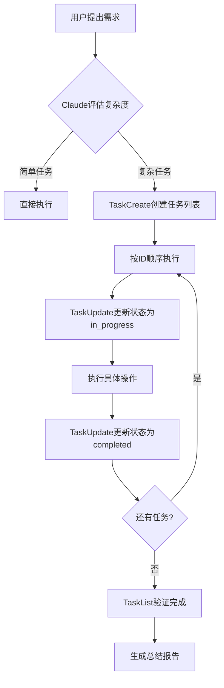

# Claude Code 任务系统完全指南

> **版本**: v2.1.19+
> **更新日期**: 2026年2月
> **适用范围**: Claude Code CLI、IDE扩展、Web版
> **难度**: ⭐⭐⭐ (中级)
> **重要性**: ⭐⭐⭐⭐⭐ (必学)

---

## 📋 目录

- [1. 系统概述](#1-系统概述)
- [2. 核心工具详解](#2-核心工具详解)
- [3. 应用场景](#3-应用场景)
- [4. 工作流程](#4-工作流程)
- [5. 最佳实践](#5-最佳实践)
- [6. 配置与启用](#6-配置与启用)
- [7. 与现有系统集成](#7-与现有系统集成)
- [8. 常见问题](#8-常见问题)
- [9. 版本历史](#9-版本历史)
- [10. 进阶技巧](#10-进阶技巧)

---

## 1. 系统概述

### 1.1 什么是任务系统？

**任务系统**是 Claude Code 在 v2.1.19 版本引入的**原生任务追踪和管理框架**。它提供了一套结构化的工具，用于在对话过程中创建、管理和跟踪复杂的多步骤任务。

### 1.2 设计理念

- **轻量级集成**：无需额外配置，默认启用
- **智能触发**：自动识别复杂任务并创建追踪
- **状态管理**：维护任务的生命周期状态
- **依赖追踪**：处理任务间的依赖关系
- **进度可视化**：实时展示工作进展

### 1.3 核心特性

| 特性 | 说明 | 示例 |
|------|------|------|
| 自动任务创建 | 识别复杂任务后自动拆解 | "实现用户认证" → 创建多个子任务 |
| 状态追踪 | pending → in_progress → completed | 实时更新任务状态 |
| 依赖管理 | 处理任务间的前置关系 | 任务B等待任务A完成 |
| 元数据支持 | 添加自定义标签和注释 | 高优先级、前端相关等 |
| 会话持久化 | 任务列表保存在会话中 | 可随时查看历史任务 |

### 1.4 与传统对话的区别

| 方面 | 传统对话模式 | 任务系统模式 |
|------|-------------|-------------|
| 任务追踪 | 依赖对话记忆 | 结构化任务列表 |
| 进度查看 | 需要回顾对话 | TaskList 一目了然 |
| 状态管理 | 隐性状态 | 显性状态标记 |
| 任务中断 | 容易遗漏步骤 | 自动恢复和提醒 |
| 复盘总结 | 手动整理 | 自动生成报告 |

---

## 2. 核心工具详解

### 2.1 TaskCreate - 创建任务

**用途**：创建新的任务并添加到任务列表

**参数说明**：

```typescript
{
  subject: string;        // 任务标题（必填，祈使句形式）
  description: string;    // 详细描述（必填，包含验收标准）
  activeForm?: string;    // 进行时态描述（可选，用于进度显示）
  metadata?: {            // 自定义元数据（可选）
    priority?: 'high' | 'medium' | 'low';
    category?: string;
    estimatedTime?: string;
  }
}
```

**使用示例**：

```javascript
// 简单任务
TaskCreate({
  subject: "创建用户数据模型",
  description: "定义 User schema 包含 email、password、createdAt 字段",
  activeForm: "正在创建用户数据模型"
})

// 带元数据的任务
TaskCreate({
  subject: "实现登录 API",
  description: `
  创建 POST /api/auth/login 端点：
  - 验证邮箱和密码
  - 生成 JWT token
  - 返回用户信息和 token
  验收标准：Postman 测试通过，返回 200 状态码
  `,
  activeForm: "正在实现登录 API",
  metadata: {
    priority: "high",
    category: "backend",
    estimatedTime: "30分钟"
  }
})
```

**何时自动触发**：

- ✅ 用户提出包含多个步骤的需求（"实现用户认证系统"）
- ✅ Claude 识别出需要 3+ 个独立操作的任务
- ✅ 复杂的 Bug 修复涉及多个文件
- ✅ 重构工作需要多个阶段

### 2.2 TaskList - 列出任务

**用途**：查看当前所有任务及其状态

**输出格式**：

```
任务列表（共 5 个任务）

[1] [ ] 创建数据库模型
      状态：待办
      依赖：无

[2] [-] 实现 REST API
      状态：进行中
      依赖：任务1

[3] [ ] 前端页面开发
      状态：待办
      依赖：任务2

[4] [x] 编写单元测试
      状态：已完成
      依赖：无

[5] [ ] 部署文档
      状态：待办
      依赖：任务2,3
```

**状态标识**：
- `[ ]` - pending（待办）
- `[-]` - in_progress（进行中）
- `[x]` - completed（已完成）

**使用时机**：
- 📋 查看整体进度
- 🔍 寻找下一个可执行任务
- 📊 生成工作报告
- 🔄 恢复中断的工作

### 2.3 TaskGet - 获取任务详情

**用途**：获取特定任务的完整信息

**参数**：
```typescript
{
  taskId: string;  // 任务ID
}
```

**返回内容**：
```json
{
  "id": "2",
  "subject": "实现 REST API",
  "description": "创建用户认证相关的API端点...",
  "status": "in_progress",
  "activeForm": "正在实现 REST API",
  "owner": "claude",
  "blocks": ["3"],
  "blockedBy": ["1"],
  "metadata": {
    "priority": "high",
    "category": "backend"
  }
}
```

### 2.4 TaskUpdate - 更新任务

**用途**：更新任务状态、添加依赖、设置所有者等

**参数说明**：

```typescript
{
  taskId: string;              // 任务ID
  status?: 'pending' | 'in_progress' | 'completed' | 'deleted';
  subject?: string;            // 更新标题
  description?: string;        // 更新描述
  activeForm?: string;         // 更新进行时描述
  owner?: string;              // 设置所有者（如分配给特定Agent）
  metadata?: object;           // 更新/合并元数据
  addBlocks?: string[];        // 添加阻塞的任务ID
  addBlockedBy?: string[];     // 添加依赖的任务ID
}
```

**常用操作示例**：

```javascript
// 开始任务
TaskUpdate({ taskId: "1", status: "in_progress" })

// 完成任务
TaskUpdate({ taskId: "1", status: "completed" })

// 设置依赖关系
TaskUpdate({
  taskId: "3",
  addBlockedBy: ["1", "2"]  // 任务3等待任务1和2完成
})

// 分配给特定代理
TaskUpdate({
  taskId: "2",
  owner: "ui-ux-designer"
})

// 删除任务
TaskUpdate({ taskId: "5", status: "deleted" })
```

### 2.5 TaskStop - 停止任务

**用途**：停止正在运行的后台任务或子代理

**参数**：
```typescript
{
  task_id: string;  // 要停止的任务ID
}
```

### 2.6 TaskOutput - 获取任务输出

**用途**：获取已完成或正在运行任务的输出结果

**参数**：
```typescript
{
  task_id: string;
  block?: boolean;    // 是否等待完成（默认true）
  timeout?: number;   // 超时时间（毫秒）
}
```

---

## 3. 应用场景

### 3.1 日常对话（主要应用场景）

任务系统主要在**日常对话中自动应用**，用于管理复杂任务。

#### 场景1：新功能开发

```
用户：我需要实现一个用户认证系统，包括注册、登录、密码重置功能

Claude：
我来帮你实现这个功能。让我先创建任务列表：

✓ 已创建任务 "设计数据库Schema"
✓ 已创建任务 "实现注册API"
✓ 已创建任务 "实现登录API"
✓ 已创建任务 "实现密码重置API"
✓ 已创建任务 "编写单元测试"
✓ 已创建任务 "更新API文档"

现在开始执行第一个任务...
```

#### 场景2：Bug修复

```
用户：用户报告登录时会话过期太快

Claude：
分析中...

✓ 已创建任务 "定位会话过期问题"
✓ 已创建任务 "修复JWT配置"
✓ 已创建任务 "添加刷新token机制"
✓ 已创建任务 "回归测试"

让我先检查会话配置...
```

#### 场景3：代码重构

```
用户：这个模块需要重构，代码太乱了

Claude：
我来分析这个模块并制定重构计划。

✓ 已创建任务 "分析当前代码结构"
✓ 已创建任务 "识别代码异味"
✓ 已创建任务 "设计新架构"
✓ 已创建任务 "逐步重构（保持测试通过）"
✓ 已创建任务 "性能对比测试"

首先让我读取现有代码...
```

### 3.2 Skills（自定义命令）

**重要说明**：任务系统**不会自动应用**在 Skills 中，但可以在 Skill 定义内部**手动使用**。

#### 在Skill中使用任务系统

```markdown
---
description: "用于新增功能开发的命令"
---

# 用户输入
$ARGUMENTS

## 执行流程

### 步骤1：创建任务追踪

<function_calls>
<invoke name="TaskCreate">
<parameter name="subject">需求分析</parameter>
<parameter name="description">分析用户需求并确定技术方案</parameter>
<parameter name="activeForm">正在分析需求</parameter>
</invoke>
</function_calls>

### 步骤2：执行规划

<function_calls>
<invoke name="TaskUpdate">
<parameter name="taskId">1</parameter>
<parameter name="status">in_progress</parameter>
</invoke>
</function_calls>

开始分析需求...

[后续工作流程]
```

#### 何时在Skill中使用任务系统

✅ **推荐使用**：
- 长时间运行的复杂工作流
- 需要向用户展示进度的场景
- 多人协作项目

❌ **不推荐使用**：
- 简单的单步操作
- 快速命令（如 git commit）
- 幕后执行的自动化任务

### 3.3 Agents（代理）

Agent 内部可以使用任务系统来组织其工作流程。

#### 示例：规划代理

```markdown
---
name: planner
description: 项目规划和任务分解专家
color: green
---

你是一位专业的项目规划专家。

## 工作流程

当接到复杂任务时：

1. **创建规划任务**
   ```
   TaskCreate({
     subject: "需求分析",
     description: "理解用户需求并识别关键约束",
     activeForm: "正在分析需求"
   })
   ```

2. **创建技术方案任务**
   ```
   TaskCreate({
     subject: "技术方案设计",
     description: "设计系统架构和技术栈选择",
     activeForm: "正在设计方案",
     addBlockedBy: ["1"]
   })
   ```

3. **创建文档输出任务**
   ```
   TaskCreate({
     subject: "生成规划文档",
     description: "输出详细的实施计划",
     activeForm: "正在生成文档",
     addBlockedBy: ["2"]
   })
   ```

4. **按依赖顺序执行**

## 输出要求

只返回 Markdown 文档内容，不执行具体开发任务。
```

---

## 4. 工作流程

### 4.1 标准任务流程



### 4.2 完整示例：实现用户注册功能

#### 第1步：需求分析

```
用户：帮我实现用户注册功能，需要邮箱验证

Claude：好的，我来实现这个功能。让我先创建任务列表。

[调用 TaskCreate]
✓ 任务1：设计用户表Schema
✓ 任务2：创建注册API端点
✓ 任务3：实现邮箱验证服务
✓ 任务4：编写注册单元测试
✓ 任务5：更新API文档
```

#### 第2步：开始执行

```
[调用 TaskUpdate]
→ 任务1状态：pending → in_progress

正在设计用户表Schema...

[使用 Read、Write 等工具创建迁移文件]
✓ 已创建 database/migrations/20240204_create_users.sql

[调用 TaskUpdate]
→ 任务1状态：in_progress → completed
```

#### 第3步：继续下一个任务

```
[调用 TaskList]
待办任务：2, 3, 4, 5
进行中：无
已完成：1

[调用 TaskUpdate]
→ 任务2状态：pending → in_progress

正在创建注册API端点...

[编写代码]
✓ 已创建 src/api/auth/register.ts
✓ 已创建 src/validators/auth.ts

[调用 TaskUpdate]
→ 任务2状态：in_progress → completed
```

#### 第4步：处理依赖任务

```
[调用 TaskList]
待办任务：3, 4, 5
进行中：无
已完成：1, 2

[调用 TaskUpdate]
→ 任务3状态：pending → in_progress

正在实现邮箱验证服务...

[发现需要配置SMTP]
[调用 TaskCreate]
✓ 任务6：配置SMTP服务
✓ 任务5.1：更新文档添加SMTP配置说明

[完成邮件服务实现]
[调用 TaskUpdate]
→ 任务3状态：in_progress → completed
```

#### 第5步：完成所有任务

```
[继续执行任务4、5、6...]

[调用 TaskList]
所有任务已完成！

生成最终报告：
✓ 创建了5个文件
✓ 修改了3个现有文件
✓ 添加了15个测试用例
✓ 更新了API文档

测试建议：
1. 运行 npm test 验证单元测试
2. 使用 Postman 测试注册端点
3. 检查邮箱接收验证邮件
```

### 4.3 中断和恢复

#### 中断场景

```
[正在执行任务2...]
用户：等一下，我需要先处理其他事情

Claude：好的，任务2保持进行中状态。
当前进度：
- [x] 任务1：设计用户表Schema（已完成）
- [-] 任务2：创建注册API端点（进行中）
- [ ] 任务3：实现邮箱验证服务（待办）

你可以随时说"继续"来恢复工作。
```

#### 恢复场景

```
用户：继续

Claude：恢复工作...

[调用 TaskList]
当前状态：
- 任务2处于进行中状态

[调用 TaskGet taskId="2"]
正在继续"创建注册API端点"...

继续执行...
```

---

## 5. 最佳实践

### 5.1 何时使用任务系统

#### ✅ 推荐使用的场景

1. **多步骤功能开发**
   - 新功能实现（5+ 步骤）
   - 跨模块修改
   - 需要前后端配合

2. **复杂Bug修复**
   - 涉及多个文件
   - 需要重现和分析
   - 需要回归测试

3. **代码重构**
   - 大规模重构
   - 性能优化
   - 架构调整

4. **学习和探索**
   - 理解复杂代码库
   - 调研新技术
   - 编写技术文档

#### ❌ 不需要使用的场景

1. **简单操作**
   - 单文件修改
   - 快速查询
   - 简单配置更改

2. **一次性任务**
   - 临时脚本
   - 快速原型
   - 实验性代码

3. **纯咨询对话**
   - 代码解释
   - 概念询问
   - 技术讨论

### 5.2 任务命名规范

#### Subject（标题）

✅ 好的标题：
```
"创建用户数据模型"
"实现登录API端点"
"编写邮箱验证单元测试"
"部署到生产环境"
```

❌ 不好的标题：
```
"用户相关"  # 太模糊
"开始做注册"  # 口语化
"问题？"  # 不明确
"TODO"  # 无信息量
```

#### Description（描述）

包含以下要素：
- **具体目标**：要达成什么
- **涉及文件**：哪些文件会被修改
- **验收标准**：如何确认完成

✅ 好的描述：
```
创建 POST /api/auth/login 端点：
1. 验证邮箱格式和密码强度
2. 查询数据库验证用户
3. 生成 JWT token（有效期24小时）
4. 返回用户信息和token

涉及文件：
- src/api/auth/login.ts（新建）
- src/middleware/auth.ts（修改）
- src/types/user.ts（修改）

验收标准：
- Postman测试返回200状态码
- 错误情况返回适当的错误码
- Token可以通过其他API验证
```

❌ 不好的描述：
```
做登录功能  # 太简单
见文档      # 无具体内容
```

#### ActiveForm（进行时描述）

用于进度显示，应该让用户知道正在发生什么。

✅ 好的activeForm：
```
"正在创建用户数据模型"
"正在实现登录API"
"正在运行单元测试"
"正在部署到生产环境"
```

### 5.3 依赖关系管理

#### 正确的依赖设置

```javascript
// 场景：前端依赖后端API

TaskCreate({
  subject: "设计API接口",
  description: "定义RESTful API规范"
})

TaskCreate({
  subject: "实现后端API",
  description: "实现API端点",
  addBlockedBy: ["1"]  // 依赖任务1
})

TaskCreate({
  subject: "开发前端页面",
  description: "开发UI并调用API",
  addBlockedBy: ["2"]  // 依赖任务2
})

TaskCreate({
  subject: "编写集成测试",
  description: "测试前后端联调",
  addBlockedBy: ["3"]  // 依赖任务3
})

TaskCreate({
  subject: "编写API文档",
  description: "更新API文档",
  addBlockedBy: ["1"]  // 只依赖任务1
})
```

#### 依赖关系图示

```
任务1: 设计API接口
  ↓
任务2: 实现后端API
  ↓
任务3: 开发前端页面
  ↓
任务4: 编写集成测试

任务5: 编写API文档 (与任务2并行)
```

### 5.4 元数据使用

```javascript
TaskCreate({
  subject: "优化数据库查询",
  description: "添加索引和重写慢查询",
  activeForm: "正在优化数据库",
  metadata: {
    priority: "high",        // 优先级
    category: "performance", // 分类
    estimatedTime: "2小时",  // 预估时间
    assignedTo: "backend",   // 分配给
    labels: ["database", "optimization", "urgent"],
    sprint: "Sprint-23"
  }
})
```

### 5.5 任务粒度

#### 过细的问题

```javascript
// ❌ 太细（每个文件一个任务）
TaskCreate({ subject: "创建user.ts" })
TaskCreate({ subject: "创建auth.ts" })
TaskCreate({ subject: "创建middleware.ts" })
TaskCreate({ subject: "创建routes.ts" })
TaskCreate({ subject: "创建controllers.ts" })

// ✅ 合理（按功能模块）
TaskCreate({
  subject: "创建认证模块",
  description: "创建用户认证相关的所有文件和逻辑"
})
```

#### 过粗的问题

```javascript
// ❌ 太粗（一个任务包含整个项目）
TaskCreate({
  subject: "实现电商网站",
  description: "从零开始实现一个完整的电商平台"
})

// ✅ 合理（按主要阶段拆分）
TaskCreate({ subject: "设计数据库架构" })
TaskCreate({ subject: "实现后端API" })
TaskCreate({ subject: "开发前端界面" })
TaskCreate({ subject: "集成支付系统" })
```

---

## 6. 配置与启用

### 6.1 版本要求

- ✅ v2.1.19+：任务系统首次引入
- ✅ v2.1.20+：修复多个bug，优化性能
- ✅ v2.1.30+：添加任务指标统计

### 6.2 启用状态

**默认状态**：✅ 默认启用

无需任何配置，安装 Claude Code 后任务系统自动可用。

### 6.3 禁用任务系统

#### 临时禁用（当前会话）

```bash
# macOS/Linux
export CLAUDE_CODE_ENABLE_TASKS=false

# Windows CMD
set CLAUDE_CODE_ENABLE_TASKS=false

# Windows PowerShell
$env:CLAUDE_CODE_ENABLE_TASKS="false"

# 然后启动 Claude Code
claude
```

#### 永久禁用

**Windows PowerShell**：
```powershell
[System.Environment]::SetEnvironmentVariable(
  "CLAUDE_CODE_ENABLE_TASKS",
  "false",
  "User"
)
```

**macOS/Linux**：
```bash
# 添加到 ~/.bashrc 或 ~/.zshrc
echo 'export CLAUDE_CODE_ENABLE_TASKS=false' >> ~/.bashrc
source ~/.bashrc
```

### 6.4 重新启用

**删除环境变量**：

```bash
# macOS/Linux
unset CLAUDE_CODE_ENABLE_TASKS
# 或从 ~/.bashrc 中删除对应行

# Windows PowerShell
[System.Environment]::SetEnvironmentVariable(
  "CLAUDE_CODE_ENABLE_TASKS",
  $null,
  "User"
)
```

---

## 7. 与现有系统集成

### 7.1 与 Git工作流集成

```javascript
// 任务1：功能开发
TaskCreate({
  subject: "开发用户认证功能",
  description: "实现注册、登录、密码重置"
})

// 任务2：创建分支
TaskCreate({
  subject: "创建feature分支",
  description: "git checkout -b feature/user-auth",
  addBlockedBy: ["1"]
})

// 任务3：提交代码
TaskCreate({
  subject: "提交代码",
  description: "git commit -m 'feat: add user authentication'",
  addBlockedBy: ["2"]
})

// 任务4：推送和创建PR
TaskCreate({
  subject: "推送并创建PR",
  description: "git push && gh pr create",
  addBlockedBy: ["3"]
})
```

### 7.2 与测试框架集成

```javascript
// TDD 工作流

// 阶段1：测试先行
TaskCreate({
  subject: "编写失败的测试",
  description: "先写测试，预期失败",
  metadata: { tdd: "red" }
})

// 阶段2：最小实现
TaskCreate({
  subject: "编写最小实现",
  description: "刚好能让测试通过的代码",
  addBlockedBy: ["1"],
  metadata: { tdd: "green" }
})

// 阶段3：重构
TaskCreate({
  subject: "重构代码",
  description: "优化代码结构，保持测试通过",
  addBlockedBy: ["2"],
  metadata: { tdd: "refactor" }
})

// 阶段4：重复
TaskCreate({
  subject: "下一个功能",
  addBlockedBy: ["3"]
})
```

---

## 8. 常见问题

### 8.1 使用相关

#### Q1: 任务系统会在什么时候自动创建任务？

**A**：Claude 会在以下情况自动创建任务：

1. **复杂度判断**：当任务包含 3+ 个独立步骤
2. **用户明确要求**：用户说"制定计划"、"拆分任务"
3. **多文件操作**：涉及修改多个文件
4. **长期工作**：预计需要多次交互才能完成
5. **明确的工作流**：新功能开发、重构、Bug修复流程

**不会自动创建**：
- 简单查询（"这个函数做什么？"）
- 单文件操作（"创建一个文件"）
- 快速修复（"修复这个typo"）
- 临时命令（"运行测试"）

#### Q2: 我可以手动创建任务吗？

**A**：可以！你可以直接要求：

```
用户：帮我创建任务列表，用于重构用户模块

Claude：
好的，我来创建任务列表：

✓ 任务1：分析现有代码结构
✓ 任务2：识别代码异味
✓ 任务3：设计新架构
✓ 任务4：逐步重构
✓ 任务5：性能测试
```

#### Q3: 任务会在会话之间持久化吗？

**A**：**不会**。任务列表仅在当前会话有效。

**持久化方案**：
1. 使用规划文档系统（如你的 `zcf:feat`）
2. 在任务完成时生成总结文档
3. 使用 Git 提交记录保存工作历史

---

## 9. 版本历史

### v2.1.19 (2025-01-23)

**新功能**：
- ✨ 首次引入任务系统
- ✨ 添加 TaskCreate、TaskList、TaskGet、TaskUpdate 工具
- ✨ 自动任务创建和依赖管理
- ✨ 任务状态追踪

**配置**：
- 添加 `CLAUDE_CODE_ENABLE_TASKS` 环境变量

### v2.1.20 (2025-01-27)

**修复**：
- 🐛 修复会话压缩问题
- 🐛 修复代理忽略用户消息问题
- 🐛 修复任务列表显示位置问题

**改进**：
- ✨ 添加任务删除功能
- ✨ 优化任务列表动态调整
- ✨ 改进 fork 对话提示

### v2.1.30 (2026-02-03)

**新功能**：
- ✨ 添加任务指标统计（token数、工具调用、持续时间）
- ✨ 改进 TaskStop 工具

**改进**：
- 🔧 任务结果格式化
- 🔧 调试功能增强

---

## 10. 进阶技巧

### 10.1 任务模板

创建可复用的任务模板：

```javascript
// 用户可在 .claude/tasks.json 中定义模板

{
  "templates": {
    "feature-development": [
      {
        "subject": "需求分析",
        "description": "理解功能需求并识别技术约束"
      },
      {
        "subject": "技术设计",
        "description": "设计系统架构和技术方案",
        "addBlockedBy": ["1"]
      },
      {
        "subject": "实现核心功能",
        "description": "实现主要功能代码",
        "addBlockedBy": ["2"]
      },
      {
        "subject": "编写单元测试",
        "description": "为核心功能编写测试",
        "addBlockedBy": ["3"]
      }
    ]
  }
}
```

### 10.2 跨会话任务追踪

```javascript
// 会话1：开始项目

用户：开始实现用户认证系统

Claude：
<function_calls>
<invoke name="TaskCreate">
<parameter name="subject">用户认证系统</parameter>
<parameter name="description">实现注册、登录、密码重置</parameter>
<parameter name="metadata">{ "sessionId": "session-001" }</parameter>
</invoke>
</function_calls>

[创建多个子任务]

<function_calls>
<invoke name="Write">
<parameter name="filePath">./.claude/session-001-tasks.md</parameter>
<parameter name="content"># Session 001: 用户认证系统

## 任务列表
- [ ] 设计数据库
- [ ] 实现API
- [ ] 前端开发
- [ ] 测试

## 会话信息
- 开始时间：2026-02-04
- 状态：进行中
</parameter>
</invoke>
</function_calls>

// 会话2：继续工作

用户：继续用户认证系统的工作

Claude：
<function_calls>
<invoke name="Read">
<parameter name="filePath">./.claude/session-001-tasks.md</parameter>
</invoke>
</function_calls>

找到上一个会话的任务记录。正在恢复工作...

<function_calls>
<invoke name="TaskCreate">
<parameter name="subject">设计数据库</parameter>
<parameter name="description">...</parameter>
</invoke>
<invoke name="TaskCreate">
<parameter name="subject">实现API</parameter>
<parameter name="description">...</parameter>
</invoke>
...
</function_calls>
```

---

## 附录

### A. 快速参考

| 工具 | 用途 | 常用参数 |
|------|------|---------|
| `TaskCreate` | 创建任务 | subject, description, activeForm |
| `TaskList` | 列出所有任务 | 无 |
| `TaskGet` | 获取任务详情 | taskId |
| `TaskUpdate` | 更新任务 | taskId, status, addBlockedBy |
| `TaskStop` | 停止任务 | task_id |
| `TaskOutput` | 获取输出 | task_id, block |

### B. 状态流转

```
pending (待办)
    ↓
in_progress (进行中)
    ↓
completed (已完成)

    ↓ (任何时候)
deleted (已删除)
```

### C. 环境变量

| 变量名 | 默认值 | 说明 |
|--------|--------|------|
| `CLAUDE_CODE_ENABLE_TASKS` | (未设置=启用) | 启用/禁用任务系统 |

### D. 最佳实践清单

- [ ] 任务标题使用祈使句（"创建X"而非"创建X的任务"）
- [ ] 描述包含验收标准
- [ ] 合理设置任务粒度（不过细也不过粗）
- [ ] 正确使用依赖关系
- [ ] 定期使用 TaskList 检查进度
- [ ] 完成后生成总结文档
- [ ] 与Git工作流集成
- [ ] 使用元数据增强可追踪性
- [ ] 保持任务列表整洁（删除过期任务）
- [ ] 结合规划系统使用

---

## 结语

任务系统是 Claude Code 强大的工作组织工具，它可以帮助你：

✅ **更好地管理复杂项目**
✅ **追踪工作进度**
✅ **避免遗漏步骤**
✅ **提高工作效率**

记住：
- 任务系统是**增强工具**，不是必需品
- 简单任务无需使用
- 复杂项目事半功倍
- 与现有工作流结合效果最佳

祝你使用愉快！🎉

---

**文档版本**: v1.0
**最后更新**: 2026年2月5日
**作者**: 基于 Claude Code v2.1.19+ 官方文档整理
**整合者**: knowknowcc 项目组
